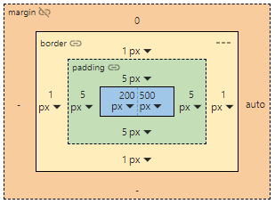

# Vue Box Model Editor


**Box Model Editor** is a Vue component that allows the editing of the box model of a DOM element.
This is totally inspired to the Chrome Dev Tools component.



> [!IMPORTANT]  
> ## FEATURE DISCLAIMER
> This component does **NOT** actually manipulate the DOM in any way: its purpose it to receive input models describing the actual box model of an element, allowing the editing of this model and returning the manipulated model as output.
>
> The typical intended use case for this component is inside an **editor** (or similar kind of product).

## Installation
You can install the package in your project with the following command:

```bash
npm install v-box-model-editor
```

## Usage
This library exports the ```BoxModelEditor``` component. You can use it as follows:

```typescript
// INSIDE YOUR CODE
import { BoxModelEditor } from 'v-box-model-editor'; // Import component
import 'v-box-model-editor/style.css'; // Import component's style
```

```HTML
<!-- INSIDE YOUR TEMPLATE -->
<BoxModelEditor :availableUnits="['px', 'em', 'rem', 'vw', 'vh', '%']"
                :margin="margin"
                :border="border"
                :padding="padding"
                :size="size"
                @update:margin="value => margin = value"
                @update:border="value => border = value"
                @update:padding="value => padding = value"
                @update:size="value => size = value" />
```

## ```box``` and ```size``` models
The ```margin```, ```border``` and ```padding``` properties use the same input/output model, the ```BoxModel```, with the following structure:

```TypeScript
export class BoxModel {
  public isLinked: boolean = true;

  public top: number = null;

  public topUnit: string = 'px';
  
  public right: number = null;
  
  public rightUnit: string = 'px';

  public bottom: number = null;
  
  public bottomUnit: string = 'px';

  public left: number = null;

  public leftUnit: string = 'px';
}
```

The ```size``` property uses the ```SizeModel``` input/output model, with the following structure:

```TypeScript
export class SizeModel {
  public width: number = null;
  
  public widthUnit: string = 'px';
  
  public height: number = null;

  public heightUnit: string = 'px';
}
```